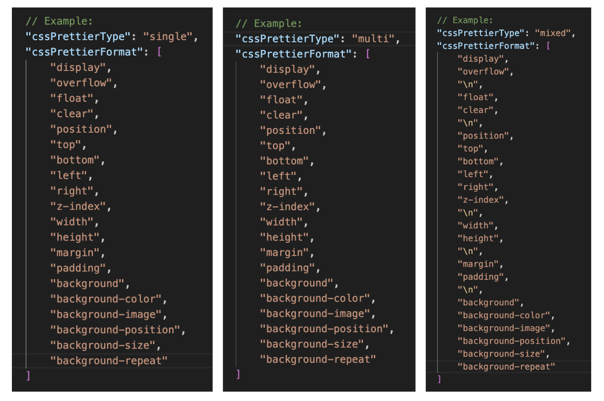
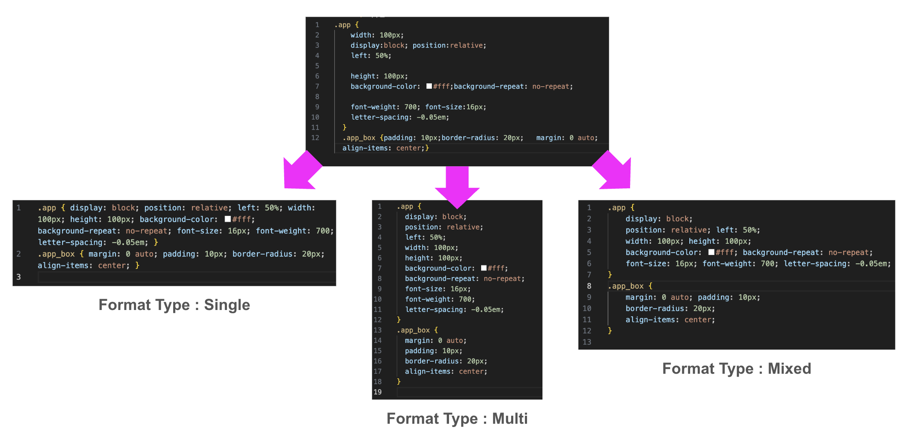

<h1 style="text-align: center; word-break: keep-all;">코드를 빠르고 깔끔하게 정리해주는 커스텀 CSS 자동 정렬 도구</h1>

🛠️ 단 한번의 타이핑으로 CSS 스타일 완벽 정리

✔️ 개발 효율성을 높이는 동일한 포맷의 CSS 스타일

## 기획 배경

스타일 가이드가 없는 회사에선 CSS 컨벤션을 한줄 코딩/여러줄 코딩(모든 속성 줄바꿈)만 정해놓고 사용합니다.

이러한 프로젝트들은 작업 인원 변동과 실시간 수정사항 반영이 있을때 minor한 수정을 위해서 모든 스타일을 읽어야만하는 문제에 직면하게 됩니다.

프로젝트 배포 후 코딩 컨벤션의  중요성을 안 회사는 급하게 코딩 컨벤션 작업을 요하지만, 적용을 위해선 작업자들과 협의 및 설득, 그리고 작업환경에 익숙해지기 위한 시간이 필요합니다.

하지만 현업이라는 전쟁터에 사는 우리는 시간이 없고, 신규 프로젝트와 수정사항을 쳐내기 바쁩니다 😢

바로 이럴때 우리는 **'커스텀 CSS 자동 정렬 도구'** 가 필요합니다❗️

## 데모 영상

"settings.jsonc" 내 원하는 cssPrettierType 과 cssPrettierFormat 을 설정 후 CSS 파일 저장 시 ❗️폴더 내 모든 CSS 파일이 아닌❗️ 해당 파일만 적용 됩니다. 

## 기능 정의

**cssPrettierType**
- **single** : 모든 스타일 선언을 한 줄에 배치합니다. 스타일 시트를 간결하게 유지하려는 경우에 적합합니다.
- **multi** : 각 스타일 선언을 새로운 줄에 배치하고, 들여쓰기를 추가하여 시각적 구분을 강화합니다. 복잡한 스타일 블록에 유용합니다.
- **mixed** : 줄바꿈을 선택적으로 삽입하여, 일부 선언은 강조하고 나머지는 간결하게 처리합니다.

**cssPrettierFormat**
- 스타일 정렬 순서를 지정합니다. 
- 지정되지 않은 스타일은 마지막에 배치됩니다. 
- **mixed** 타입에서는 줄바꿈을 위해 "\n"을 추가하세요.

    ( single / multi 타입에서는 "\n" 정상 동작 하지 않습니다 🙅‍♀️ )

## 사용 방법
1. "settings.jsonc" 파일 내 가이드에 따라 원하는 스타일을 지정해주세요.

2. 자동 정렬을 원하는 CSS 파일에서 "ctrl + S / cmd + S" 키를 사용하여 파일 자동 정렬 + 저장해주세요.

## 이슈사항

- CSS 파일만 변환됨 => SCSS 파일도 적용 대상에 추가 예정 🔆

## 릴리즈 노트

### 1.0.0

커스텀 CSS 자동 정렬 도구 최초 업로드

## 제작자

    <strong style="font-size: 16px; font-weight: 600;">조현홍</strong>+

## 라이센스

- MIT